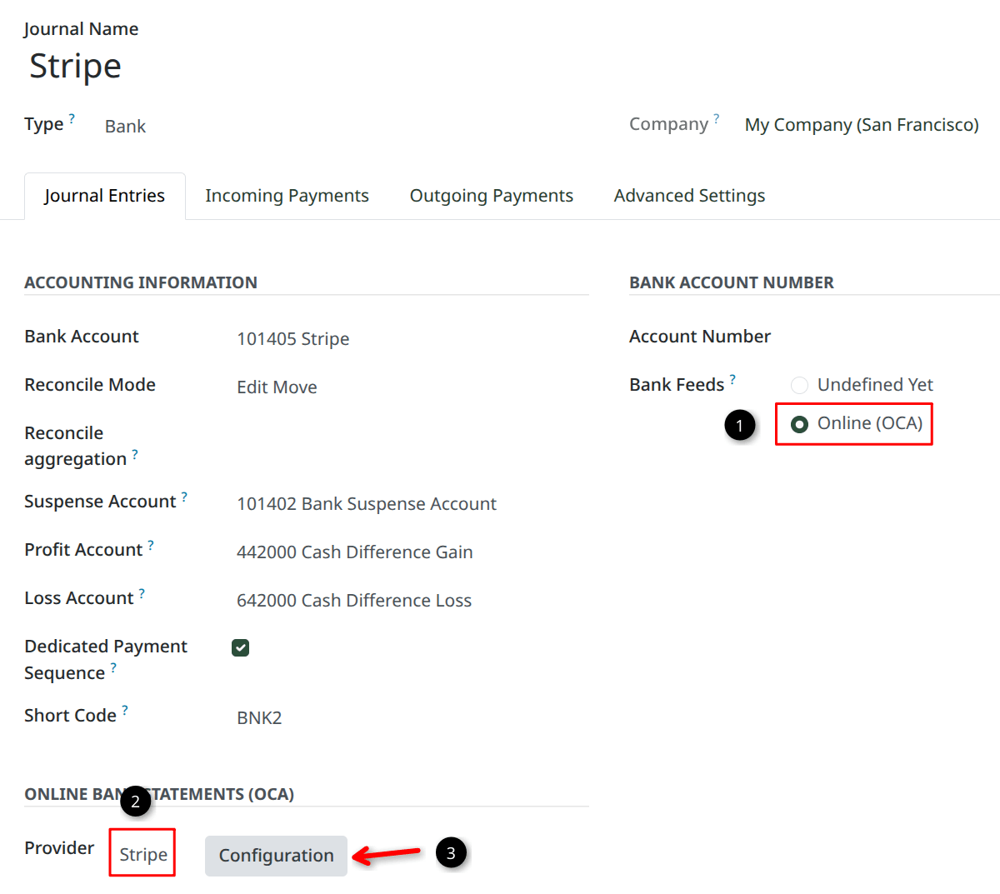

## Invoice matching

1. Go to **Invoicing (or Accounting) > Configuration > Payment Providers** and configure
   the Stripe payment provider.
2. Select a bank journal as the provider's **Payment Journal**. Its inbound Stripe payment
   method must use a reconcilable Outstanding Receipts account. A dedicated Stripe journal
   is recommended.
3. On the Stripe provider, click **Create Terminal Webhook** next to **Terminal Webhook
   Secret**. One Terminal webhook is sufficient for all readers using that provider.
4. [Enable standalone mode](https://docs.stripe.com/terminal/payments/standalone-mode/get-started)
   for the Stripe Terminal location and reboot the reader.

## Stripe balance and bank reconciliation

Importing and reconciling Stripe balance activity is outside this module's scope. The
following optional setup is for reference purposes, and provides an end-to-end accounting workflow for Stripe payments,
fees, and payouts.

### Additional modules

- `account_statement_import_online_stripe`
  ([source](https://github.com/OCA/bank-statement-import/tree/18.0/account_statement_import_online_stripe))
  from `OCA/bank-statement-import` imports Stripe balance transactions.
- To synchronize the destination bank automatically, use a suitable connector such as
  `account_statement_import_online_plaid` or `account_statement_import_online_ponto`, or
  import its statements manually.

### Setup

1. Open the dedicated Stripe payment journal and set **Bank Feeds** to **Online (OCA)**.
2. In **Online Bank Statements (OCA)**, select **Stripe** as the provider and save the
   journal.
3. Click **Configuration** next to the provider field.

4. Confirm that the service is **Stripe**, then enter a Stripe secret key with access to
   balance transactions in **API Key** and save.
5. Configure statement synchronization or imports for the bank account that receives the
   Stripe payouts.

### Full workflow

This is the expected workflow once bank account syncing is configured:

1. This module posts an inbound payment that debits Outstanding Receipts and credits
   Accounts Receivable. Odoo reconciles the receivable line with the invoice.
2. Synchronizing the Stripe journal imports a positive gross payment line and a separate
   negative fee line. Reconcile the gross payment with Outstanding Receipts and categorize
   the fee to the appropriate expense account (such as "Bank Fees").
3. A Stripe payout appears as a negative line in the Stripe journal, while the deposit
   appears as a positive line in the destination bank journal. Reconcile the pair as an
   internal transfer between the two journals.

Reconciliation models can automate some of this matching. Their configuration is outside
the scope of this README.
