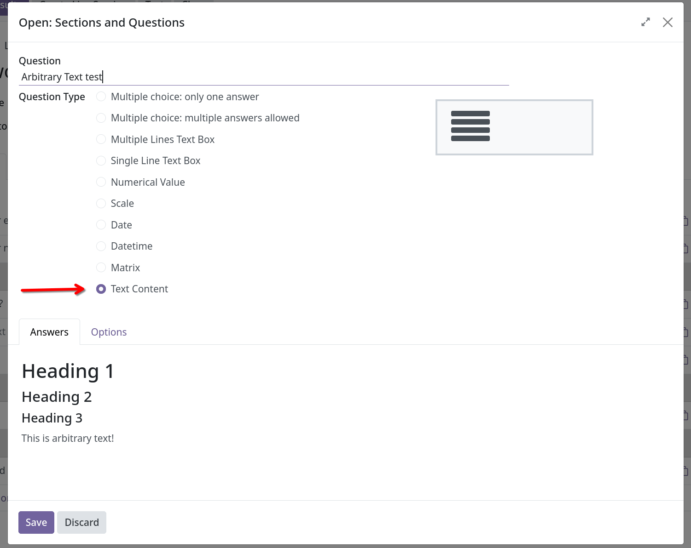
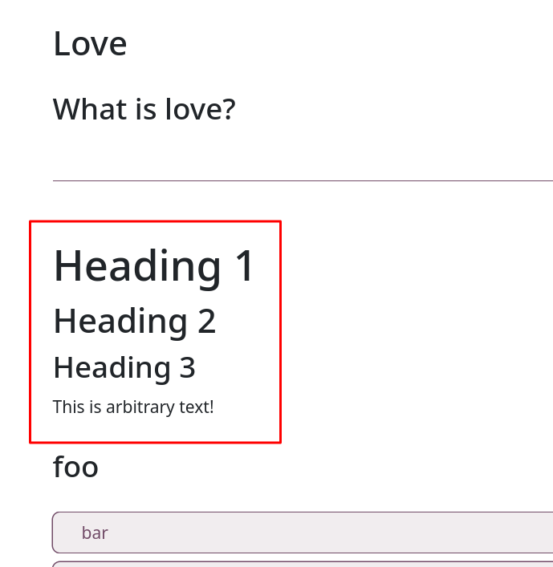

In the "Add a Question" modal, use the new "Text Content" option:

This uses the standard Odoo rich-text editor, so you can add headings, make text bold or italic, add links, etc.

Since it's treated like a question, you can insert it anywhere on the page:

